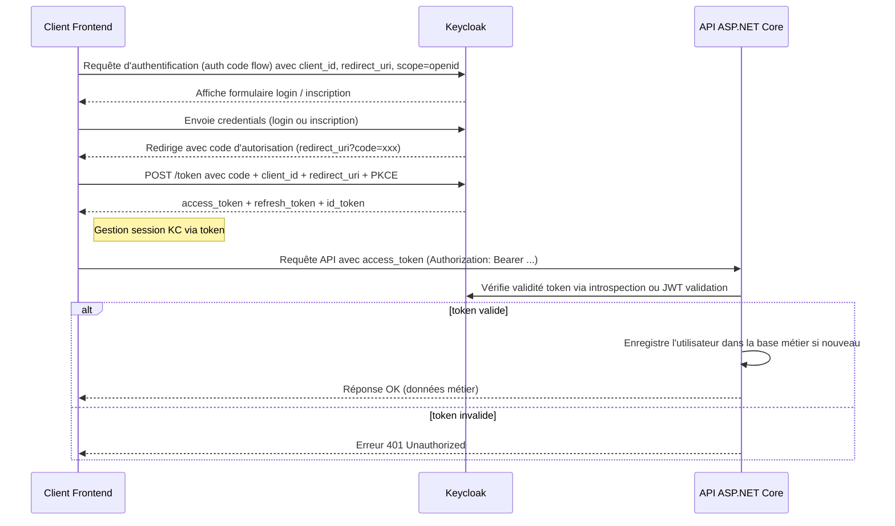
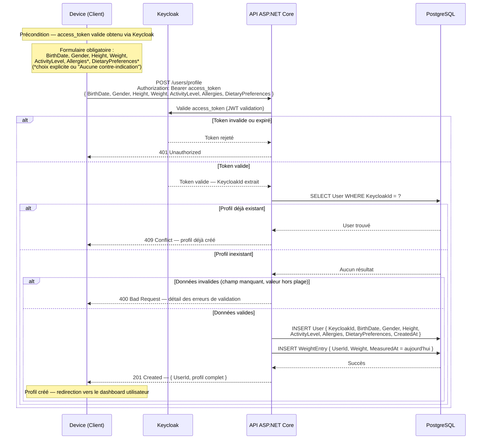
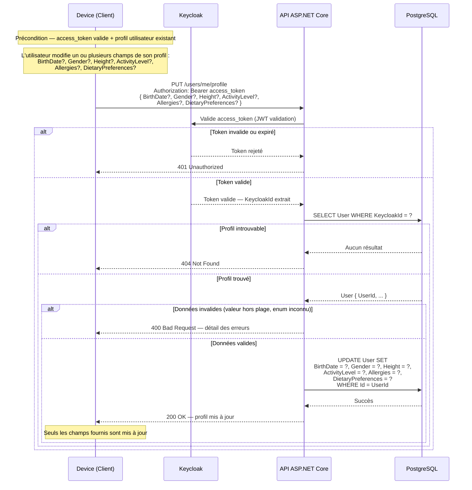
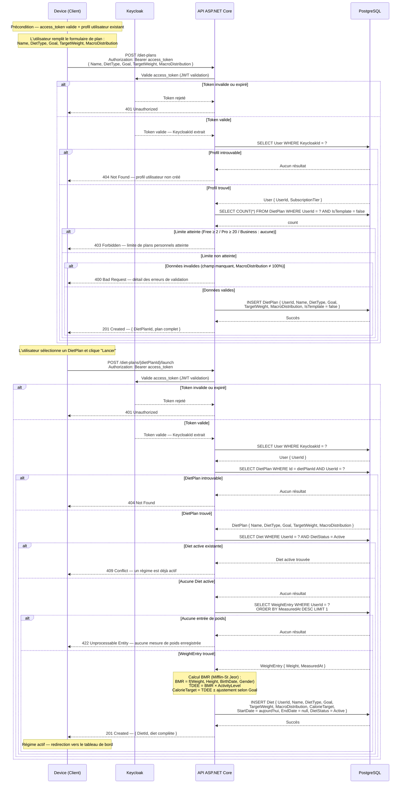
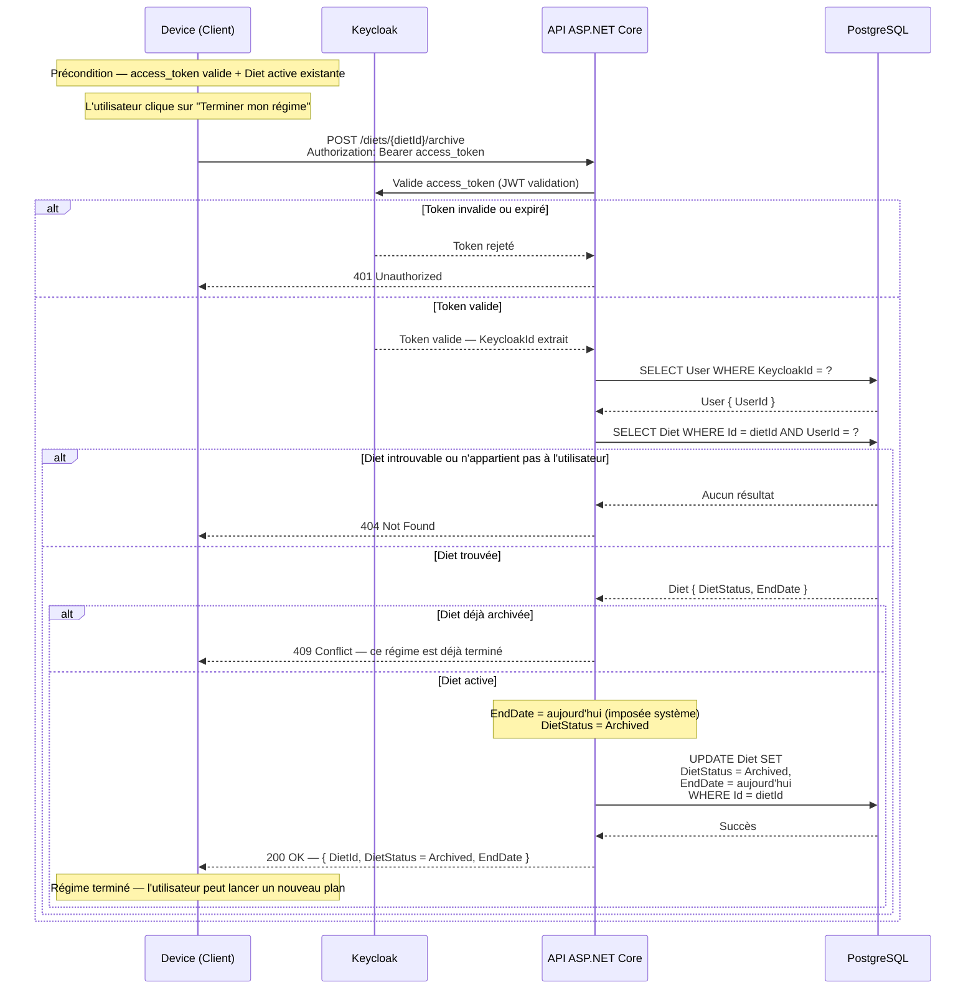
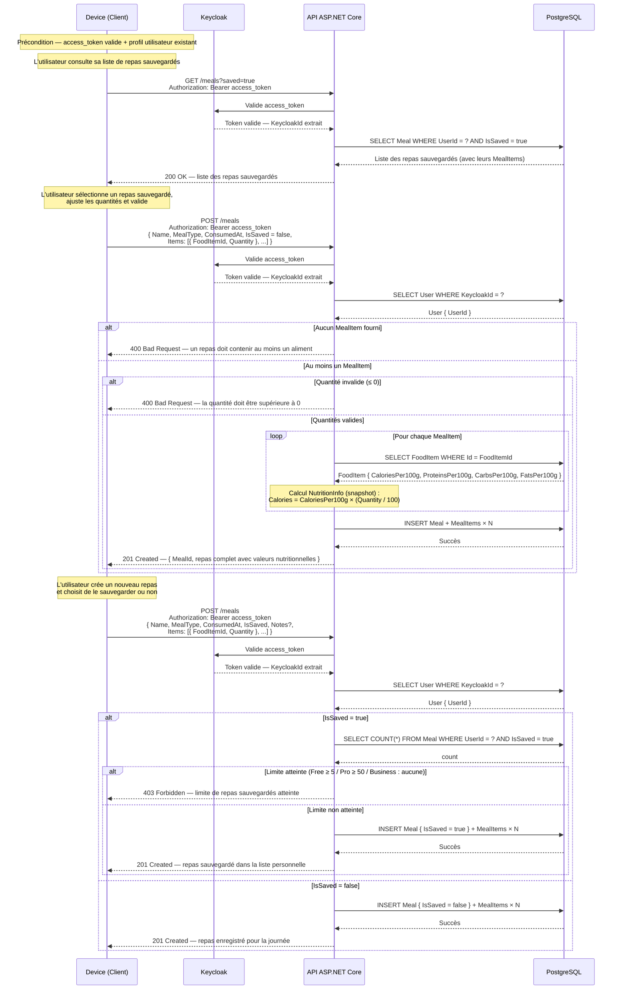
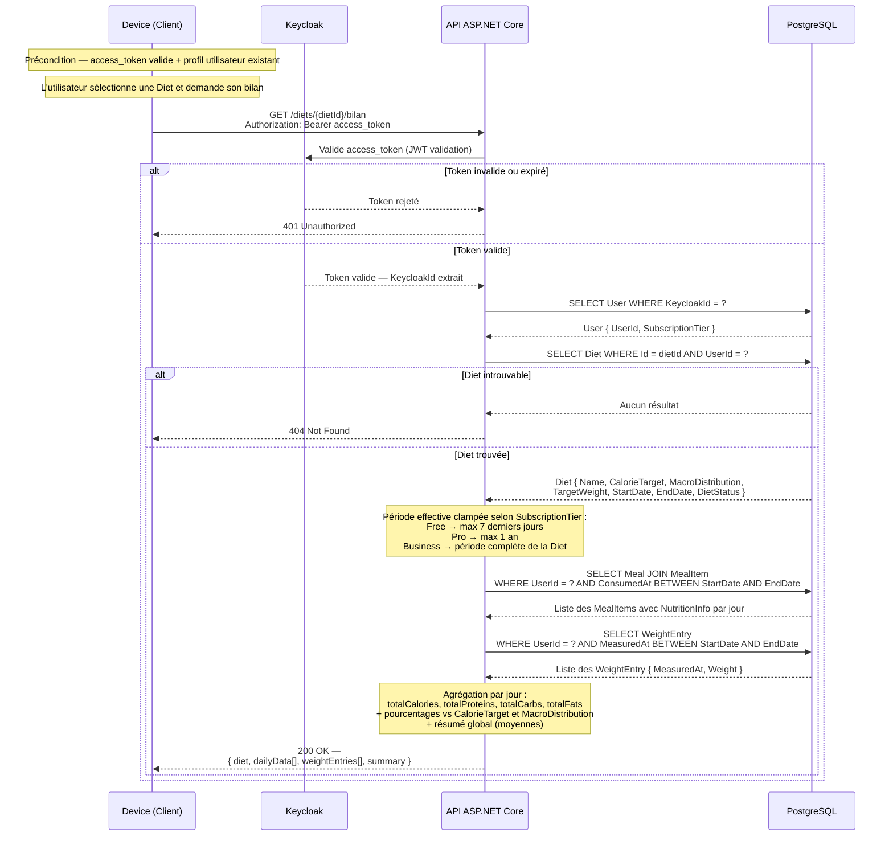
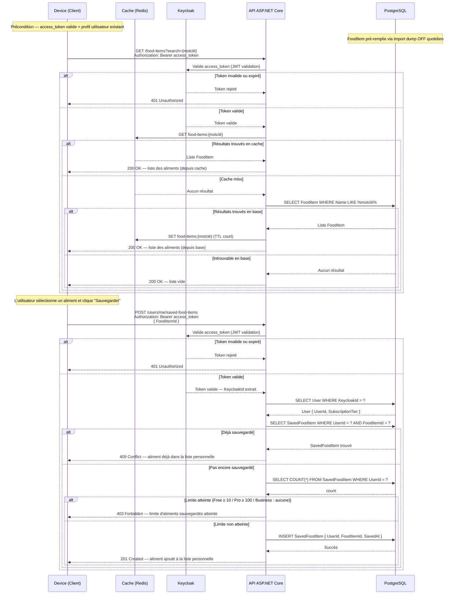
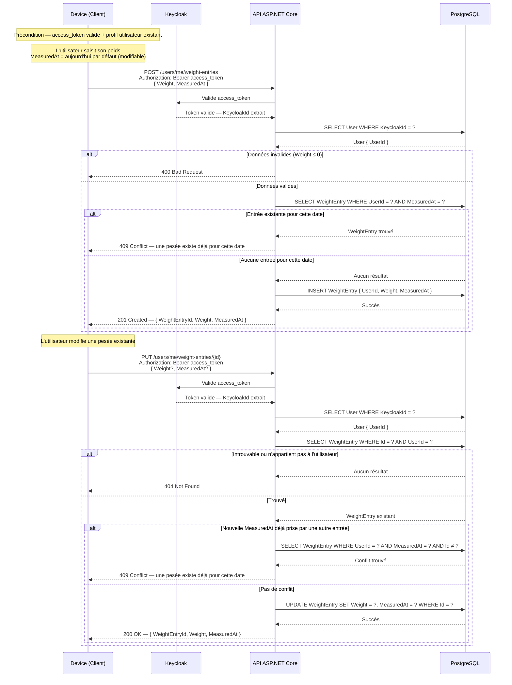
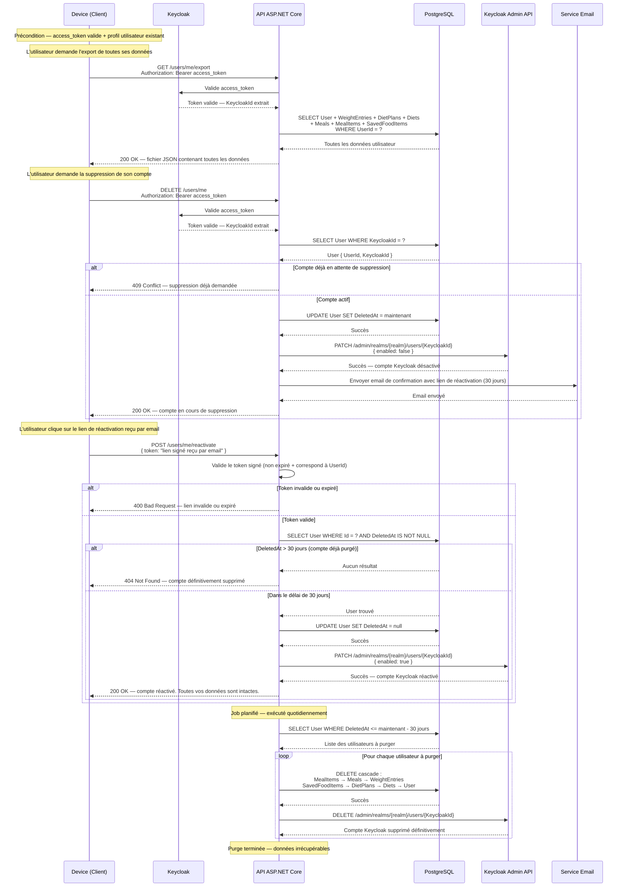

# Workflows — Flux métier

> Tous les flux séquentiels du système Nutrition API.
> Source : fichiers `.mermaid` dans `annexes/`.

---

## 1. Authentification

---

## 2. Création du profil utilisateur

---

## 3. Mise à jour du profil

---

## 4. Gestion des DietPlans et lancement

---

## 5. Terminer une Diet

---

## 6. Enregistrement de repas

---

## 7. Bilan nutritionnel

---

## 8. Recherche d'aliment

---

## 9. Gestion du poids

---

## 10. RGPD

