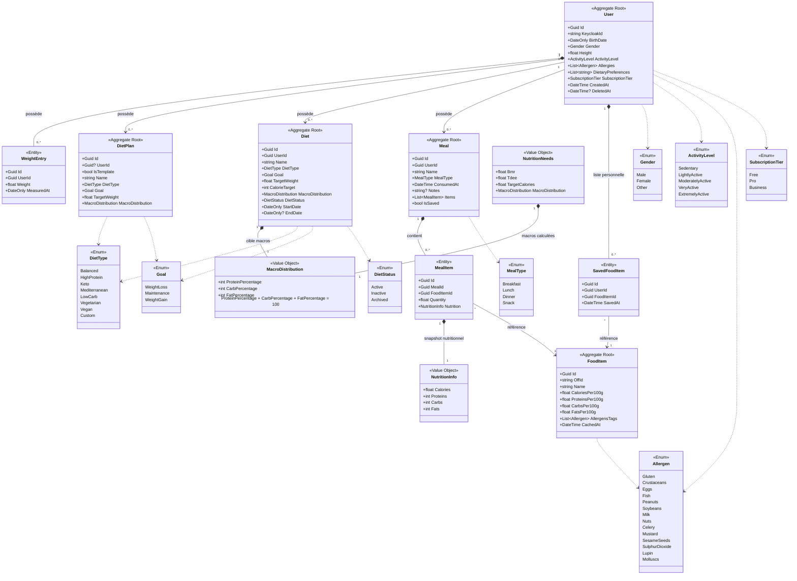

# Diagramme de classes — API Nutrition

> Généré depuis `Modele-domaine.md`.
> Source de vérité : `Modele-domaine.md` — modifier ce fichier en cas de changement.

---

---

## Légende

| Notation | Signification |
|---|---|
| `◆──` (composition) | L'enfant n'existe pas sans le parent — suppression en cascade |
| `──>` (association) | Référence — les deux objets ont des cycles de vie indépendants |
| `..>` (dépendance) | Utilise un enum ou un type externe |
| `<<Aggregate Root>>` | Point d'entrée du système, accessible par son Id |
| `<<Entity>>` | Entité enfant, accessible uniquement via son parent |
| `<<Value Object>>` | Valeur immuable sans identité propre |
| `<<Enum>>` | Liste fixe de valeurs |
